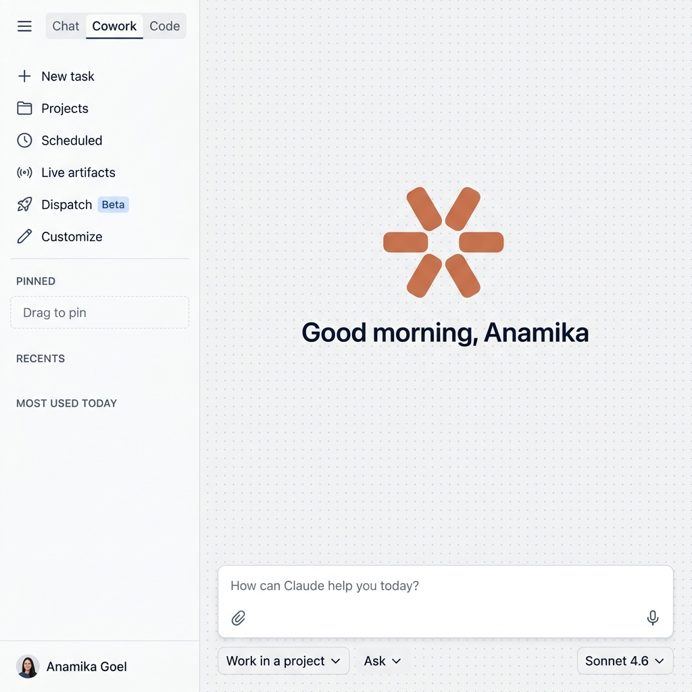

# Claude Cowork — Workflow Memory

A high-fidelity React prototype that simulates an intelligent **Workflow Memory** system for Claude's Cowork feature. It detects recurring multi-step workflows from natural language, tracks usage patterns across sessions, and nudges users to automate repetitive tasks.



---

## ✨ Key Features

### 🔍 Intelligent Workflow Detection
- Detects multi-step workflows from natural language prompts in real-time
- Dual-condition detection: **sequential structure** (first/then/next) + **final deliverable** (report/brief/doc)
- Rule-based classification into workflow categories (Competitor Brief, Sprint Retro, etc.)
- Dynamic step extraction from prompt content

### 📂 Session-Based Chat Management
- Every conversation is session-based — all messages grouped under one session
- Session history displayed in the **Recents** sidebar section
- Hover over any session to see detected workflow name badges (deduplicated)

### 📊 Most Used Workflows
- Aggregates workflow usage across all sessions
- Shows workflow count badges (×2, ×3, etc.)
- Hover to see all 4 workflow steps
- **Automate** badge appears at ×3 — opens scheduling modal

### ⚡ Smart Notifications
- **Toast popup** when any workflow reaches ×3 usage — auto-dismisses after 5 seconds
- **90% usage alert** fires when 10 total user messages are sent globally:
  - **State A** — Last message is a workflow used before → "Automate →" button
  - **State B** — Last message is not a workflow or first use → simple usage notice

### 📅 Scheduled Task System
- Create automated tasks with name, description, prompt, frequency, and time
- Frequency options: Manual, Hourly, Daily, Weekdays, Weekly
- Task cards with persistent configuration
- Modal opens from alert bar, Most Used section, or Scheduled page

---

## 🛠 Tech Stack

| Technology | Purpose |
|-----------|---------|
| **React 18** | UI framework (Functional Components + Hooks) |
| **Vite 8** | Build tool and dev server |
| **Vanilla CSS** | Styling with Atlassian Design System tokens |
| **crypto.randomUUID()** | Unique ID generation |
| **Inter Font** | Typography (Google Fonts) |

---

## 📁 Project Structure

```
Claude-MVP/
├── docs/                          # Documentation
│   ├── system-design.md           # High-level system architecture
│   ├── user-flow.md               # User flow diagrams (Mermaid)
│   ├── wireframes.md              # Wireframe guide + design tokens
│   └── wireframe-*.png            # Screen wireframes
├── public/
│   ├── favicon.svg                # Claude asterisk favicon
│   └── icons.svg                  # Icon sprites
├── src/
│   ├── App.jsx                    # State hub — all logic lives here
│   ├── index.css                  # Global design tokens + resets
│   ├── main.jsx                   # React entry point
│   ├── utils/
│   │   └── workflowDetector.js    # Workflow detection engine
│   └── components/
│       ├── Chat/
│       │   ├── AlertBar.jsx       # 90% usage alert (State A/B)
│       │   ├── ChatInput.jsx      # Message composer
│       │   ├── ChatView.jsx       # Chat messages + alert
│       │   └── Chat.css
│       ├── Home/
│       │   ├── HomeView.jsx       # Landing page with prompt input
│       │   └── Home.css
│       ├── Modal/
│       │   ├── CreateTaskModal.jsx # Task creation/scheduling form
│       │   └── Modal.css
│       ├── Scheduled/
│       │   ├── ScheduledPage.jsx   # Scheduled tasks dashboard
│       │   ├── TaskCard.jsx        # Individual task card
│       │   └── Scheduled.css
│       └── Sidebar/
│           ├── Sidebar.jsx         # Main sidebar with navigation
│           ├── RecentsSection.jsx   # Session list + hover badges
│           ├── MostUsedSection.jsx  # Workflow aggregation + automate
│           └── Sidebar.css
├── index.html
├── package.json
└── vite.config.js
```

---

## 🚀 Getting Started

### Prerequisites
- **Node.js** 18+ installed
- **npm** 9+ installed

### Installation

```bash
# Clone the repository
git clone https://github.com/anamikagoel18/Claude-MVP.git
cd Claude-MVP

# Install dependencies
npm install

# Start development server
npm run dev
```

The app will be available at `http://localhost:5173`

### Build for Production

```bash
npm run build
npm run preview
```

---

## 🧪 Testing Guide

### Workflow Detection Test
Use any of these prompts to trigger workflow detection:

```
First research competitor products in the CRM space, then compare features, then analyze gaps, and format the output as a PDF brief
```

```
First collect team feedback from the last sprint, then identify blockers and wins, then document action items, and format as a retro summary doc
```

### Toast Popup Test (×3 Trigger)
Send the same workflow type in **3 separate sessions** → ⚡ toast appears at the top.

### 90% Alert Test
Send **10 user messages** across any number of sessions:
- If the 10th message is a **previously-used workflow** → **State A** (Automate →)
- If the 10th message is **not a workflow** → **State B** (simple message)

### Non-Workflow Messages
These will NOT trigger workflow detection:
```
What are the best practices for onboarding new team members?
Can you explain the difference between REST and GraphQL APIs?
```

---

## 🔧 Workflow Detection Rules

| Rule | Trigger Keywords | Workflow Name |
|------|-----------------|---------------|
| Rule 1 | competitor, benchmark, market analysis, compare features | Competitor Brief |
| Rule 2 | sprint retro, blockers, action items, team feedback | Sprint Retro |
| Rule 3 | email/inbox | Email Summary |
| Rule 3 | feedback/survey | Feedback Analysis |
| Rule 3 | social/campaign | Campaign Brief |
| Rule 3 | data/metric | Data Report |
| Rule 3 | user/customer | User Research |
| Rule 3 | code/technical | Tech Review |

**Both conditions required:** Sequential structure + Final deliverable keyword

---

## 📐 Design System

Built using **Atlassian Design System** principles:

- **Colors:** `#172B4D` (primary text), `#5E6C84` (muted), `#00875A` (success), `#0052CC` (blue)
- **Typography:** Inter font family, sizes from 11px to 28px
- **Spacing:** 4px grid system
- **Border Radius:** 4px (sm), 8px (md), 12px (lg), 16px (xl)
- **Components:** Follow Atlassian button, input, card, and badge patterns

---

## 📖 Documentation

| Document | Description |
|----------|-------------|
| [System Design](docs/system-design.md) | Architecture, data models, detection engine, state flow |
| [User Flow](docs/user-flow.md) | 7 Mermaid diagrams covering all user journeys |
| [Wireframes](docs/wireframes.md) | 4 screen wireframes with component inventory |

---

## 👤 Author

**Anamika Goel** — [GitHub](https://github.com/anamikagoel18)

---

## 📄 License

This project is for demonstration and prototyping purposes.
