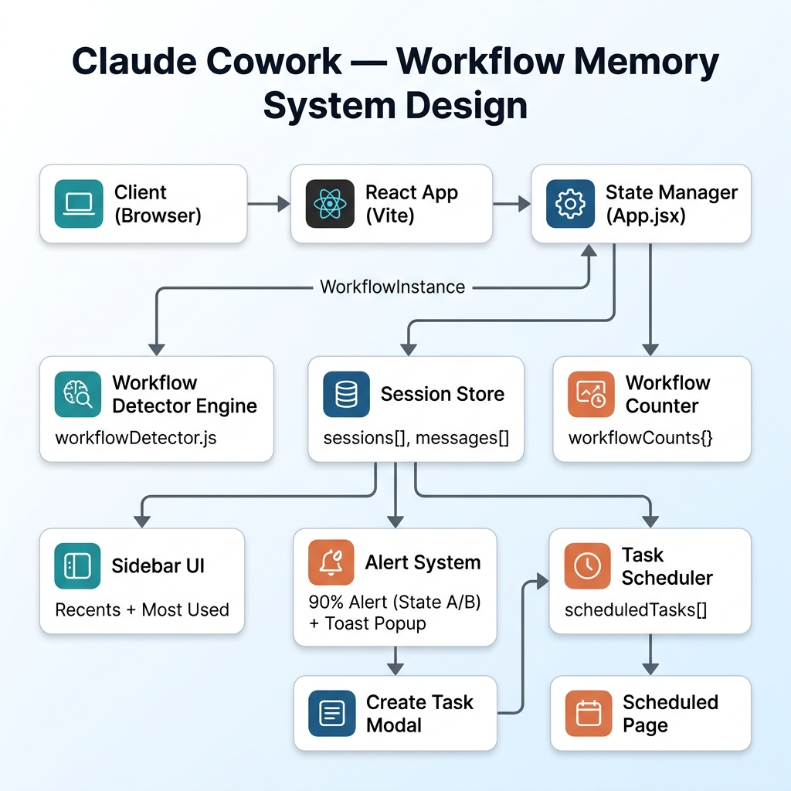

# Claude Cowork — Workflow Memory: System Design

## System Architecture Diagram



---

## Component Breakdown

### 1. Client (Browser)
The end user interacts via a web browser. The entire application runs client-side as a **Single Page Application (SPA)** — no backend server required for the prototype.

### 2. React App (Vite)
- **Framework:** React 18 with functional components and hooks
- **Build Tool:** Vite 8 for fast HMR and production builds
- **Entry Point:** `main.jsx` → renders `App.jsx`

### 3. State Manager (App.jsx)
The centralized state hub that manages all application data:

| State Field | Type | Purpose |
|-------------|------|---------|
| `sessions[]` | Array | All chat sessions with messages |
| `activeSessionId` | UUID | Currently active chat session |
| `workflowCounts{}` | Object | Global workflow frequency tracker |
| `scheduledTasks[]` | Array | Saved automation tasks |
| `globalMessageCount` | Number | Total user messages across all sessions |
| `globalAlertShown` | Boolean | Whether 90% alert has fired |
| `globalAlertState` | 'A' \| 'B' | Alert variant |
| `toastMessage` | String | ×3 workflow notification text |

### 4. Workflow Detector Engine (`workflowDetector.js`)
The intelligence layer that analyzes every user prompt:

```
Input: User prompt text
  ↓
Check 1: Sequential Structure? (first/then/next + action verbs)
  ↓
Check 2: Final Deliverable? (report/brief/PDF/doc)
  ↓
Both pass → Classify (Rule 1/2/3) → Generate steps → Return WorkflowInstance
Either fails → Return null (not a workflow)
```

**Rule Classification:**
| Rule | Keywords | Output Name |
|------|----------|-------------|
| Rule 1 | competitor, benchmark, market analysis | Competitor Brief workflow |
| Rule 2 | sprint retro, blockers, team feedback | Sprint Retro workflow |
| Rule 3 | Dynamic — email, feedback, social, data, etc. | Topic-based naming |

### 5. Session Store
In-memory storage for all session data:

```
Session {
  id: UUID
  title: string (first 9 words)
  messages: Message[]
  detectedWorkflows: WorkflowInstance[]
}

Message {
  id: UUID
  role: 'user' | 'claude'
  text: string
  workflowInstance: WorkflowInstance | null
}
```

### 6. Workflow Counter
Tracks how many times each workflow type has been used globally:

```
workflowCounts: {
  "rule1": 3,                              // Competitor Brief used 3×
  "rule2": 2,                              // Sprint Retro used 2×
  "rule3_Email Summary workflow": 1,       // Email Summary used 1×
  "rule3_Campaign Brief workflow": 2       // Campaign Brief used 2×
}
```

### 7. Sidebar UI
Two dynamic sections powered by state:

- **Recents:** Lists all sessions. Hover → shows workflow name badges (deduplicated)
- **Most Used Today:** Shows workflows with count ≥ 2. Hover → shows 4 steps. Count ≥ 3 → "Automate" badge

### 8. Alert System
Triggers when `globalMessageCount ≥ 10`:

| Condition | State | Message |
|-----------|-------|---------|
| Last msg is workflow + used ≥2× before | **A** | "You've used this workflow before — Automate →" |
| Last msg is workflow + first time | **B** | "You've used 90% of your session limit" |
| Last msg is NOT a workflow | **B** | "You've used 90% of your session limit" |

**Toast Popup:** Fires when any workflow reaches exactly ×3 usage. Auto-dismisses after 5 seconds.

### 9. Task Scheduler
Stores automation tasks created via the Create Task Modal:

```
ScheduledTask {
  id: UUID
  name: string
  description: string
  prompt: string
  frequency: 'Manual' | 'Hourly' | 'Daily' | 'Weekdays' | 'Weekly'
  time: string | null
  workflowName: string
}
```

### 10. Create Task Modal
Entry points:
- Alert State A → "Automate →" button
- Most Used section → "Automate" badge
- Scheduled page → "New task" button

Pre-fills name and prompt from workflow data when triggered from automation flow.

### 11. Scheduled Page
Displays all saved tasks as cards with name, frequency badge, and time. Includes "Keep awake" toggle and empty state illustration.

---

## Data Flow

```
User types prompt
    │
    ├──→ workflowDetector.detectWorkflow(text)
    │         ├── null → regular message
    │         └── WorkflowInstance → workflow detected
    │
    ├──→ State Updates:
    │       • session.messages += userMsg
    │       • session.detectedWorkflows += workflow
    │       • workflowCounts[key] += 1
    │       • globalMessageCount += 1
    │
    ├──→ Notification Checks:
    │       • count === 3? → Toast popup (5s)
    │       • globalMessages ≥ 10? → Alert bar (A or B)
    │
    └──→ UI Re-renders:
            • Sidebar: Recents + Most Used
            • Chat: new message bubble
            • Alert bar (if triggered)
            • Toast (if triggered)
```

---

## Tech Stack

| Layer | Technology |
|-------|-----------|
| UI Framework | React 18 |
| Build Tool | Vite 8 |
| Styling | Vanilla CSS + Atlassian Design Tokens |
| State | React useState + useCallback + useEffect |
| IDs | crypto.randomUUID() |
| Deployment | Vercel |
| Version Control | Git + GitHub |
