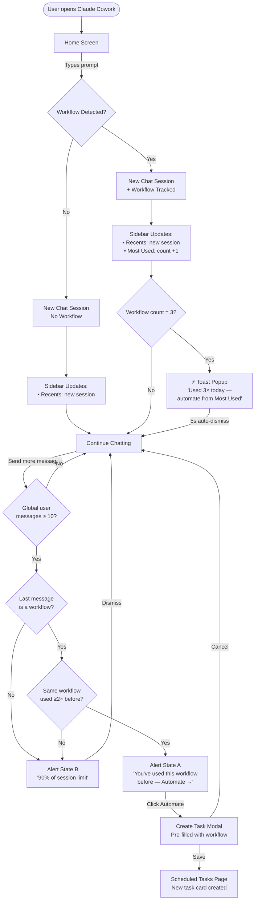
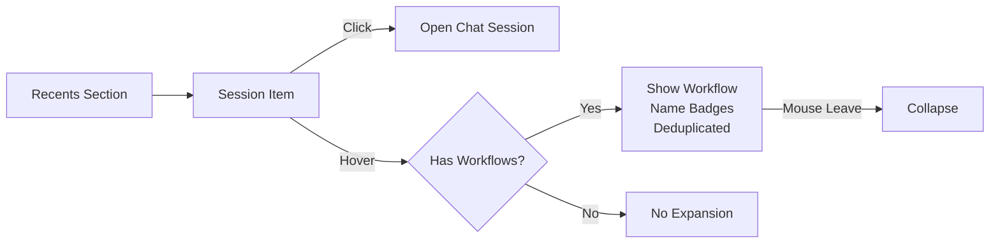
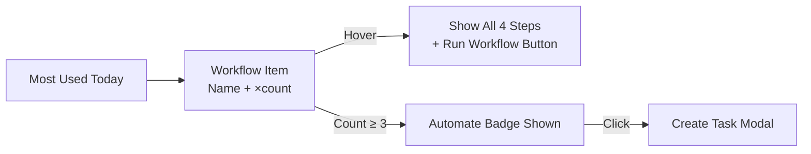
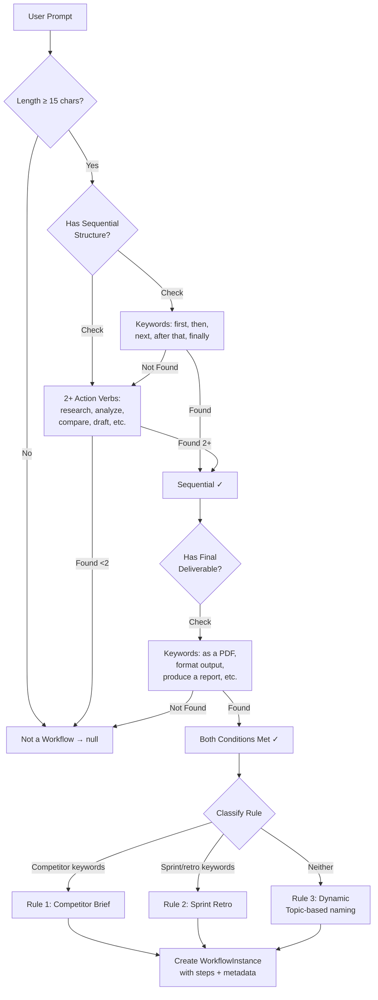
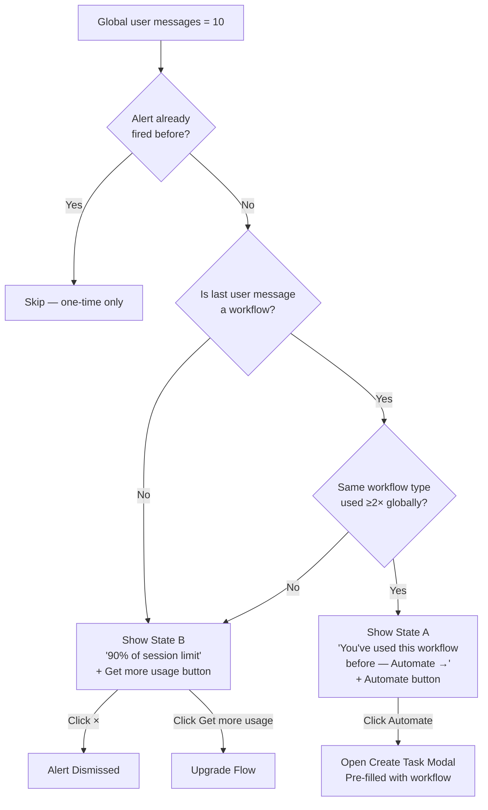
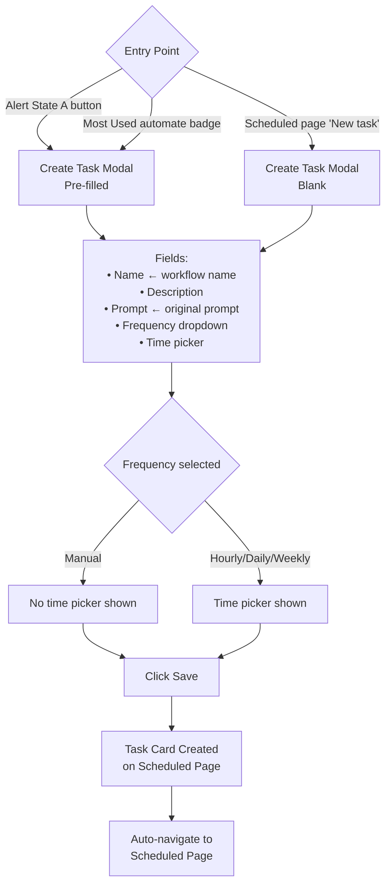
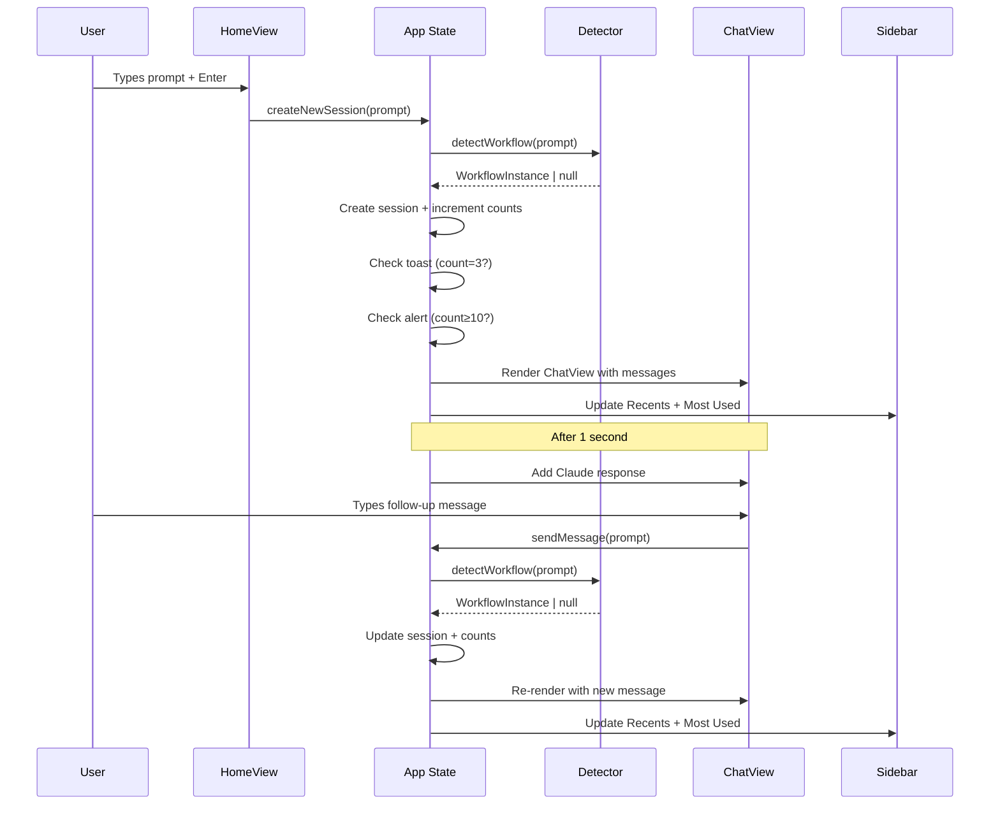
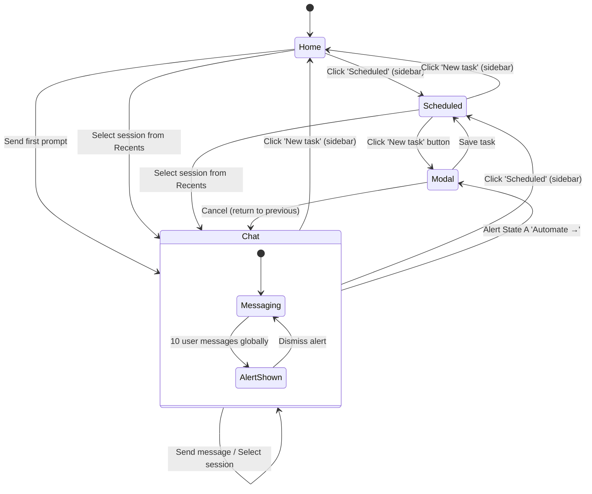

# Claude Cowork — Workflow Memory: User Flow Diagram

## 1. Primary User Journey Map

---

## 2. Sidebar Interaction Flows

### 2a. Recents Section Flow

### 2b. Most Used Section Flow

---

## 3. Workflow Detection Flow

---

## 4. 90% Alert Decision Flow

---

## 5. Scheduled Task Creation Flow

---

## 6. Session Lifecycle

---

## 7. Complete Page Navigation Map

