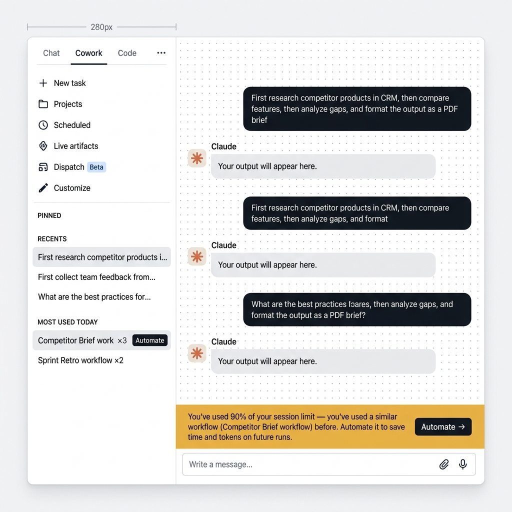
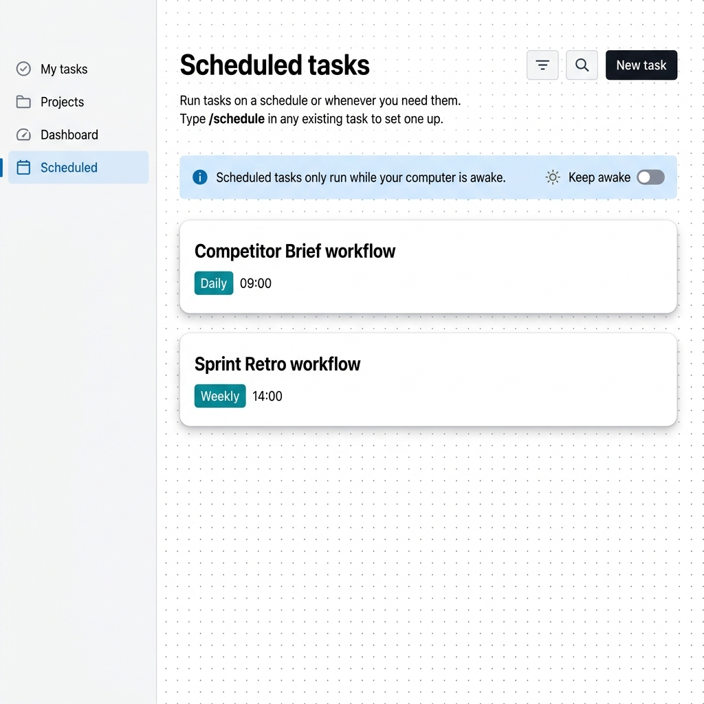
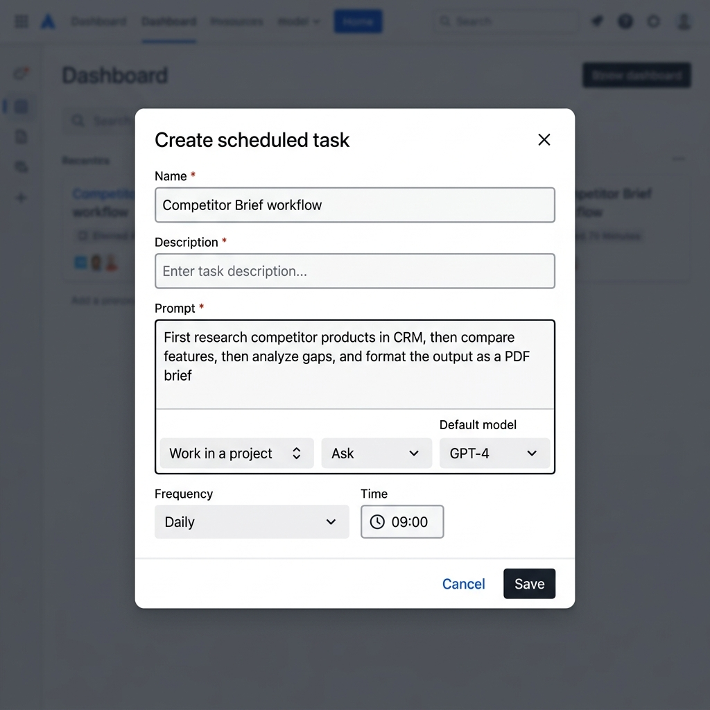

# Claude Cowork — Workflow Memory: High-Fidelity Wireframes

## Overview

These wireframes represent the four key screens of the Workflow Memory feature. The design follows the **Atlassian Design System** with consistent spacing, typography (Inter), and iconography.

---

## Screen 1: Home Screen

The landing page where users start new tasks. Features the Claude asterisk logo, greeting, and prompt input area.

**Key Elements:**
- Sidebar navigation with all sections (New task, Projects, Scheduled, etc.)
- Recents section (populates as sessions are created)
- Most Used Today section (populates as workflows are detected)
- Central prompt input with project/model selectors

---

## Screen 2: Chat View with Active Workflows

The main interaction screen showing chat messages, workflow detection results, and the intelligent 90% usage alert.

**Key Elements:**
- Chat messages (dark user bubbles, light Claude bubbles with asterisk avatar)
- Recents sidebar showing session history (hover reveals workflow badges)
- Most Used Today showing workflow counts with Automate badge at ×3+
- **State A Alert Bar** — shown when last message is a previously-used workflow
- **State B Alert Bar** — shown when last message is not a workflow or first use

---

## Screen 3: Scheduled Tasks Page

Displays all created scheduled tasks with their frequency and timing configuration.

**Key Elements:**
- Page header with title, subtitle, filter/search icons, and "New task" button
- Info banner about computer awake requirement with toggle
- Task cards showing name, frequency badge, and time
- Empty state with stopwatch illustration when no tasks exist

---

## Screen 4: Create Task Modal

The modal form for creating/scheduling a workflow automation task. Opens from multiple entry points:
- Alert State A "Automate →" button
- Most Used section "Automate" badge
- Scheduled page "New task" button

**Key Elements:**
- Name field (pre-filled with workflow name when triggered from automation)
- Description field
- Prompt textarea (pre-filled with original workflow prompt)
- Toolbar with project/ask/model selectors
- Frequency dropdown (Manual, Hourly, Daily, Weekdays, Weekly)
- Time picker (shown only when frequency ≠ Manual)
- Save/Cancel actions

---

## UI Component Inventory

| Component | Location | Interaction |
|-----------|----------|-------------|
| Session Item | Sidebar → Recents | Click to open, hover for workflow badges |
| Workflow Badge | Recents hover expand | Teal badge with check icon + workflow name |
| Most Used Item | Sidebar → Most Used | Hover for step details, click Automate |
| Automate Badge | Most Used (count ≥ 3) | Click opens Create Task Modal |
| Alert Bar (State A) | Chat bottom | Shows workflow name + Automate → button |
| Alert Bar (State B) | Chat bottom | Shows 90% message + Get more usage |
| Toast Popup | Top center overlay | Auto-dismiss after 5s, ×3 workflow nudge |
| Create Task Modal | Center overlay | Form with pre-fill from workflow data |
| Task Card | Scheduled page | Shows task name, frequency, time |

---

## Design Tokens Used

| Token | Value | Usage |
|-------|-------|-------|
| `--color-sidebar-bg` | `#FFFFFF` | Sidebar background |
| `--color-main-bg` | `#F4F5F7` | Main content area |
| `--color-primary-text` | `#172B4D` | Headings, body text |
| `--color-muted` | `#5E6C84` | Labels, secondary text |
| `--color-teal-bg` | `#E3FCEF` | Workflow badges, success states |
| `--color-teal-text` | `#00875A` | Badge text |
| `--color-automate-btn` | `#1F2937` | Dark action buttons |
| `--color-user-bubble` | `#1F2937` | Chat user message bubbles |
| `--color-claude-bubble` | `#FFFFFF` | Chat Claude message bubbles |
| `--font-family` | `Inter` | All typography |
| `--radius-md` | `8px` | Cards, modals, inputs |
